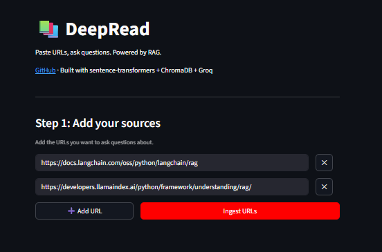
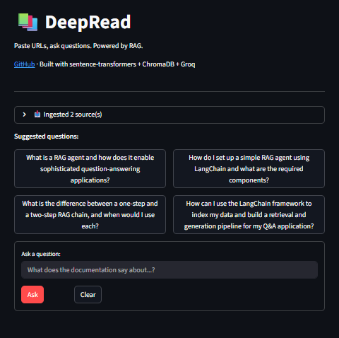
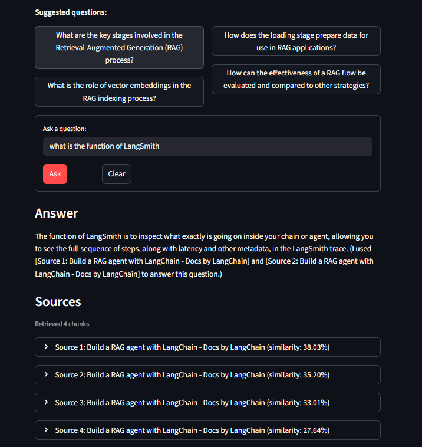

# 📚 DeepRead

> A RAG-powered Q&A app where users bring their own knowledge base from external sources (urls).

[**Live Demo**](https://your-demo-url.streamlit.app) · [**LinkedIn Post**](https://linkedin.com/in/your-profile)

DeepRead is a Retrieval-Augmented Generation (RAG) application that lets users ingest arbitrary web pages and ask questions about their content. Each user gets a private, session-scoped vector index, so your sources stay separate from everyone else's.

Built as a learning project to deeply understand RAG end-to-end — from chunking and embedding to retrieval and grounded generation — without abstracting away the interesting parts.

---

## 🎬 Demo

### Step 1: Add your sources
Users dynamically add URLs they want to query.



### Step 2: Get suggested questions and ask
After ingestion, the app uses an LLM to generate suggested questions based on the actual content, then lets users ask anything.



### Step 3: Get grounded answers with citations
Every answer cites the specific sources it used, with expandable excerpts so you can verify.



---

## 🧠 How it works

RAG is fundamentally a **two-phase system**: an offline indexing phase that prepares your knowledge base, and an online querying phase that runs on every user question.

### Architecture

```
┌─────────────────────────────────────────────────────────────────┐
│                    PHASE 1: INGESTION (offline)                 │
│                                                                 │
│   User URLs ──► Scrape HTML ──► Clean text ──► Chunk ──►        │
│                                                                 │
│   ──► Embed (sentence-transformers) ──► Store in ChromaDB       │
└─────────────────────────────────────────────────────────────────┘
                              │
                              ▼
┌─────────────────────────────────────────────────────────────────┐
│                  PHASE 2: QUERYING (per question)               │
│                                                                 │
│   User question ──► Embed query ──► Vector search top-k         │
│                                                                 │
│   ──► Build prompt with retrieved chunks ──► Groq LLM ──►       │
│                                                                 │
│   ──► Answer + cited sources                                    │
└─────────────────────────────────────────────────────────────────┘
```

The vector store is the bridge between the two phases. Indexing happens once (or whenever sources change). Querying happens every time someone asks.

### Why this matters

A regular LLM call answers from its training data — which is why it hallucinates when asked about specific docs it hasn't memorized. RAG fixes this by **giving the LLM the answer in the prompt itself**, retrieved from your actual sources. The LLM's job becomes synthesis, not recall.

### Tech stack

| Component | Choice | Why |
|---|---|---|
| Embeddings | `sentence-transformers/all-MiniLM-L6-v2` | Free, runs locally, 384-dim, good enough for docs |
| Vector store | ChromaDB (cosine distance) | Local, file-based, zero config |
| LLM | Groq (Llama 3.3 70B) | Fast, generous free tier |
| Chunking | LangChain `RecursiveCharacterTextSplitter` | Respects paragraph and sentence boundaries |
| UI | Streamlit | MVP-friendly, ships fast |
| Scraping | `requests` + `BeautifulSoup` | No JS rendering needed for docs |

---

## 📁 Project structure

```
deepread/
├── app.py                  # Streamlit UI (Phase 2 entry point)
├── ingest.py               # Standalone CLI ingestion (optional, for testing)
├── rag/
│   ├── __init__.py
│   ├── chunker.py          # URL fetching + text splitting
│   ├── retriever.py        # Embeddings + ChromaDB read/write
│   └── generator.py        # Prompt construction + LLM calls
├── data/
│   └── chroma_db/          # Vector store (gitignored, created on first run)
├── demo/                   # README assets (output from running app)
├── .env.example            # Template for environment variables (Create .env of your own !)
├── .gitignore
├── requirements.txt
└── README.md
```

Each module in `rag/` has one responsibility — `chunker` doesn't know about embeddings, `generator` doesn't know about chunking. This makes it easy to swap any piece (e.g., switch from Groq to OpenAI by editing only `generator.py`).

---

## 🚀 Run locally

### Prerequisites

- Python 3.10+
- A free [Groq API key](https://console.groq.com)

### Setup

```bash
# 1. Clone the repo
git clone https://github.com/YOUR_USERNAME/deepread.git
cd deepread

# 2. Create and activate a virtual environment
python -m venv venv
source venv/bin/activate         # Mac/Linux
# venv\Scripts\activate          # Windows

# 3. Install dependencies
pip install -r requirements.txt

# 4. Set up your environment variables
cp .env.example .env
# Open .env and add your Groq API key
```

Your `.env` should look like:

```
GROQ_API_KEY=your_key_here
```

### Run the app

```bash
streamlit run app.py
```

The app opens automatically at `http://localhost:8501`.

On first run, the embedding model (`all-MiniLM-L6-v2`, ~90MB) downloads automatically and caches locally. This is a one-time cost.

### Try it

1. Paste 1-3 documentation URLs (e.g., `https://requests.readthedocs.io/en/latest/user/quickstart/`)
2. Click **Ingest URLs** — watch the progress bar
3. Click a suggested question or type your own
4. See the answer with cited sources

---

## 🛠 Design decisions worth calling out

A few choices that shaped the project, with the tradeoffs:

**Local embeddings over OpenAI's API.** OpenAI's `text-embedding-3-small` produces marginally better embeddings, but costs money per call. For a free public demo, MiniLM is the right call. The retrieval quality is genuinely fine for documentation Q&A.

**Session-scoped vector collections.** Every user gets a unique `session_<uuid>` collection in ChromaDB so they don't see each other's sources. Simple and effective; would need rethinking at real scale.

**500-token chunks with 50-token overlap.** Smaller chunks = sharper retrieval but lost context. Larger chunks = more context but fuzzier embeddings. 500/50 is a sweet spot for prose. I tuned this empirically on a few test queries.

**Cosine distance, not L2.** ChromaDB defaults to L2 (Euclidean) which can produce distances > 1.0 — leading to confusing negative similarity percentages. Setting `hnsw:space=cosine` keeps similarity in [0%, 100%].

**The prompt is doing more work than people realize.** Three lines in the prompt template ("use only the context", "say 'I don't know' if missing", "cite sources") are what turn a regular LLM call into a RAG system. Without them, the LLM falls back on training data and hallucinates.

---


## 📝 License

MIT — see [LICENSE](./LICENSE).

---

## 🙋 About

Built by [Samuel Mahembe ](https://www.linkedin.com/in/samuel-mahembe) while studying RAG. Currently doing a Master's in Business Analytics with a software engineering background, exploring the intersection of AI engineering and business applications. Find me on [LinkedIn](https://www.linkedin.com/in/samuel-mahembe) or [GitHub](https://github.com/samuel-mahembe).
