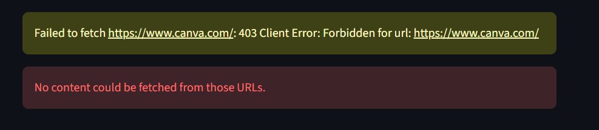

# 📚 DeepRead

> A RAG-powered Q&A app where users bring their own knowledge base from URLs or uploaded documents.

[**Live Demo**](https://your-demo-url.streamlit.app) · [**LinkedIn Post**](https://linkedin.com/in/your-profile)

DeepRead is a Retrieval-Augmented Generation (RAG) application that lets users ingest web pages or upload documents (PDF, DOCX, TXT, MD) and ask questions about their content. Each user gets a private, session-scoped vector index, so your sources stay separate from everyone else's.

Built as a learning project to deeply understand RAG end-to-end — from chunking and embedding to retrieval and grounded generation — without abstracting away the interesting parts.

---

## 🎬 Demo

### Step 1: Add your sources
Users dynamically add URLs and/or upload documents (PDF, DOCX, TXT, MD) they want to query.


#### A note on scraping

Not every site can be scraped. Some block automated requests with a `403 Forbidden` response 
(common for sites with bot protection, paywalls, or strict CDN rules). DeepRead surfaces this 
clearly rather than silently failing.



### Step 2: Get suggested questions and ask
After ingestion, the app uses an LLM to generate suggested questions based on the actual content, then lets users ask anything.


### Step 3: Get grounded answers with citations
Every answer cites the specific sources it used, with expandable excerpts so you can verify.


---

## 🧠 How it works

RAG is fundamentally a **two-phase system**: an offline indexing phase that prepares your knowledge base, and an online querying phase that runs on every user question.

### Architecture

```
┌─────────────────────────────────────────────────────────────────┐
│                    PHASE 1: INGESTION (offline)                 │
│                                                                 │
│   URLs/files ──► Scrape HTML or parse doc ──► Clean text ──►    │
│                                                                 │
│   ──► Chunk ──► Embed (sentence-transformers) ──► ChromaDB      │
└─────────────────────────────────────────────────────────────────┘
                              │
                              ▼
┌─────────────────────────────────────────────────────────────────┐
│                  PHASE 2: QUERYING (per question)               │
│                                                                 │
│   User question ──► Embed query ──► Vector search top-k         │
│                                                                 │
│   ──► Build prompt with retrieved chunks ──► Groq LLM ──►       │
│                                                                 │
│   ──► Answer + cited sources                                    │
└─────────────────────────────────────────────────────────────────┘
```

The vector store is the bridge between the two phases. Indexing happens once (or whenever sources change). Querying happens every time someone asks.

### Why this matters

A regular LLM call answers from its training data — which is why it hallucinates when asked about specific docs it hasn't memorized. RAG fixes this by **giving the LLM the answer in the prompt itself**, retrieved from your actual sources. The LLM's job becomes synthesis, not recall.

### Tech stack

| Component | Choice | Why |
|---|---|---|
| Embeddings | `sentence-transformers/all-MiniLM-L6-v2` | Free, runs locally, 384-dim, good enough for docs |
| Vector store | ChromaDB (cosine distance) | Local, file-based, zero config |
| LLM | Groq (`openai/gpt-oss-120b`) | Fast, generous free tier |
| Chunking | LangChain `RecursiveCharacterTextSplitter` | Respects paragraph and sentence boundaries |
| UI | Streamlit | MVP-friendly, ships fast |
| Scraping | `requests` + `BeautifulSoup` | No JS rendering needed for docs |
| Document parsing | `pypdf`, `python-docx` | PDF and DOCX text extraction for uploads |

> Groq periodically retires/renames models; if `llm_model` in `src/config/settings.py` starts 404ing, check `client.models.list()` for the current lineup.

---

## 📁 Project structure

```
deepread/
├── app.py                     # Streamlit UI — widgets + session state only
├── src/
│   ├── config/settings.py     # All tunables: models, chunk size, limits, timeouts
│   ├── models/schemas.py      # Shared dataclasses (Chunk, RetrievedChunk, AnswerResult, ...)
│   ├── ingestion/
│   │   ├── url_loader.py      # Fetch + scrape web pages (with SSRF guards)
│   │   ├── document_loader.py # Parse uploaded PDF/DOCX/TXT/MD
│   │   ├── cleaner.py         # Whitespace normalization + empty-content detection
│   │   ├── chunker.py         # Text splitting
│   │   └── errors.py          # Shared ingestion exception types
│   ├── embeddings/embedding_service.py
│   ├── vectorstore/chroma_store.py   # The only module that imports chromadb directly
│   ├── retrieval/
│   │   ├── retriever.py       # Embed query + vector search
│   │   └── reranker.py        # Optional cross-encoder reranking
│   ├── generation/
│   │   ├── prompts.py         # System prompt + context formatting
│   │   └── llm_service.py     # The only module that talks to Groq
│   └── rag/pipeline.py        # Orchestration layer — app.py's only entry point into src/
├── scripts/seed.py            # CLI ingestion into a persistent shared collection
├── data/
│   └── chroma_db/             # Vector store (gitignored, created on first run)
├── demo/                      # README assets (output from running app)
├── .env.example                # Template for environment variables (Create .env of your own !)
├── .gitignore
├── requirements.txt
├── requirements-dev.txt       # + pytest, ruff
└── README.md
```

Each module in `src/` has one responsibility, and `app.py` only ever calls `src.rag.pipeline` — never the lower-level modules directly. That boundary keeps the UI thin and the pipeline independently testable without Streamlit installed, and makes it easy to swap any one piece (e.g., switch from Groq to OpenAI by editing only `llm_service.py`).

---

## 🚀 Run locally

### Prerequisites

- Python 3.10+
- A free [Groq API key](https://console.groq.com)

### Setup

```bash
# 1. Clone the repo
git clone https://github.com/YOUR_USERNAME/deepread.git
cd deepread

# 2. Create and activate a virtual environment
python -m venv venv
source venv/bin/activate         # Mac/Linux
# venv\Scripts\activate          # Windows

# 3. Install dependencies
pip install -r requirements.txt

# 4. Set up your environment variables
cp .env.example .env
# Open .env and add your Groq API key
```

Your `.env` should look like:

```
GROQ_API_KEY=your_key_here
```

### Run the app

```bash
streamlit run app.py
```

The app opens automatically at `http://localhost:8501`.

On first run, the embedding model (`all-MiniLM-L6-v2`, ~90MB) downloads automatically and caches locally. This is a one-time cost.

### Try it

1. Paste 1-3 documentation URLs (e.g., `https://requests.readthedocs.io/en/latest/user/quickstart/`) and/or upload a PDF/DOCX/TXT/MD file
2. Click **Ingest sources** — watch the progress bar
3. Click a suggested question or type your own
4. See the answer with cited sources

---

## 🛠 Design decisions worth calling out

A few choices that shaped the project, with the tradeoffs:

**Local embeddings over OpenAI's API.** OpenAI's `text-embedding-3-small` produces marginally better embeddings, but costs money per call. For a free public demo, MiniLM is the right call. The retrieval quality is genuinely fine for documentation Q&A.

**Session-scoped vector collections.** Every user gets a unique `session_<uuid>` collection in ChromaDB so they don't see each other's sources. Simple and effective; would need rethinking at real scale.

**500-character chunks with 50-character overlap.** Smaller chunks = sharper retrieval but lost context. Larger chunks = more context but fuzzier embeddings. 500/50 is a sweet spot for prose. I tuned this empirically on a few test queries.

**Cosine distance, not L2.** ChromaDB defaults to L2 (Euclidean) which can produce distances > 1.0 — leading to confusing negative similarity percentages. Setting `hnsw:space=cosine` keeps similarity in [0%, 100%].

**The prompt is doing more work than people realize.** Three lines in the prompt template ("use only the context", "say 'I don't know' if missing", "cite sources") are what turn a regular LLM call into a RAG system. Without them, the LLM falls back on training data and hallucinates.

---

## 🔒 Security

DeepRead fetches URLs and parses files supplied by anonymous users, so a few things are deliberately hardened:

- **SSRF protection.** Before fetching a URL, `src/ingestion/url_loader.py` resolves its hostname and rejects private, loopback, link-local, reserved, and multicast IP ranges — so the app can't be used as a proxy to reach internal network services.
- **Resource limits.** URL responses and uploaded files are capped (`max_url_content_bytes`, `max_file_size_bytes` in `src/config/settings.py`); URL fetches are also streamed and cut off mid-download rather than buffered fully first.
- **Prompt injection mitigation.** Retrieved content is passed to the LLM in a clearly delimited, explicitly-labeled `CONTEXT` block, separate from the system instructions (see `src/generation/prompts.py`). This is a real, cheap mitigation — not a guarantee. An LLM can't fully distinguish instructions from data within one context window, so treat ingested content as still capable of influencing output, and don't feed the app sources you don't trust at all.
- **Session isolation.** Each browser session gets its own ChromaDB collection (`session_<uuid>`); sessions can't read each other's ingested content.

---

## 📝 License

MIT — see [LICENSE](./LICENSE).

---

## 🙋 About

Built by [Samuel Mahembe ](https://www.linkedin.com/in/samuel-mahembe) while studying RAG. Currently doing a Master's in Business Analytics with a software engineering background, exploring the intersection of AI engineering and business applications. Find me on [LinkedIn](https://www.linkedin.com/in/samuel-mahembe) or [GitHub](https://github.com/samuel-mahembe).
